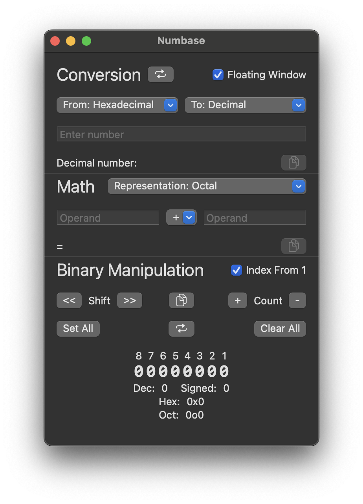

# Numbase

Numbase is a macOS utility for converting between number bases (decimal, binary, hexadecimal, and octal) and performing calculations in different bases.

## Features

### Number Base Conversion
- Convert between decimal, binary, hexadecimal, and octal number systems
- Real-time conversion with error validation
- One-click copying of results

### Mathematical Operations
- Addition (+)
- Subtraction (-)
- Multiplication (×)
- Division (÷)
- Modulo (%)
- Logical AND (&)
- Logical OR (|)
- Logical XOR (^)
- Perform calculations in any supported base

### Binary Manipulation
- Visual bit toggling
- Left/right bit shifting
- Set/Clear all bits
- Flip all bits
- Increase/decrease bit count
- View representations in all bases simultaneously
- View signed and unsigned decimal values

### Usability
- Floating window option (stays on top)
- Full keyboard navigation
- VoiceOver accessibility
- Command shortcuts
- Error feedback for invalid inputs
- Copy results to clipboard
- Index from 0 or 1 option for binary view

## Requirements
- macOS 15.0 or later
- Apple Silicon or Intel Mac

## Installation
- ~~Download from the Mac App Store~~ - Awaiting approval
- Build locally:
  1. Clone the project
  2. Open in Xcode
  3. Change the Development Team
  4. Run the app

## Support
Visit the [support page](https://jordan-christensen.com/numbase-support) for help, or submit an issue on GitHub.

## License
Numbase is Licensed under MIT. [See here](./LICENSE) for more information.

## Privacy
Numbase doesn't collect any user data and doesn't require internet connectivity.
